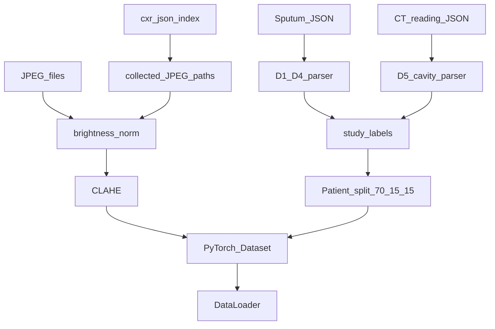

# 흉부 X-ray 기반 결핵 Multi-task Learning — 프로젝트 스펙

> **상태:** M1(데이터 파이프라인) + M2(베이스라인) 구현 완료 — 학습 실행 단계  
> **관련:** [`[중요]AFB_Scoring.md`](../[중요]AFB_Scoring.md), [`PROJECT_SUMMARY.md`](PROJECT_SUMMARY.md), `src/labels/`, `src/data/`

### 구현 현황 (M1/M2)

| 단계 | 산출물 | 명령 |
|------|--------|------|
| 라벨 | `artifacts/labels_cxr_mtl.csv` (D1–D5 + mask) | `python -m src.labels.build_graded_labels` |
| 이미지 인덱스 | `artifacts/cxr_image_manifest.csv` (12,623장 / 1,501 study) | `python -m src.data.cxr_jpeg_index` |
| 분할 | `artifacts/splits/study_split_70_15_15.json` (1,458 study) | `python scripts/build_study_split.py` |
| CLAHE 캐시 | `artifacts/clahe_cache/` (`.npy`, git 제외) | `python scripts/prewarm_clahe_cache.py` |
| 학습 A | `artifacts/cxr_mtl_vit_s_256/` | `python -m src.train_cxr_mtl --config configs/cxr_mtl_vit_s_256.yaml --tag vit_s_256` |
| 학습 B | `artifacts/cxr_mtl_swin_t_512/` | `python -m src.train_cxr_mtl --config configs/cxr_mtl_swin_t_512.yaml --tag swin_t_512` |

> AFB(D1)는 `afb_polychoric_culture_v1` (culture-anchored polychoric) 사용. 모든 patient 식별 정보(`artifacts/**`, JPEG)는 `.gitignore`로 원격 push에서 제외.

---

## 0. 한 줄 요약

**흉부 X-ray(CXR)** 를 입력으로, 객담·배양·PCR·CT 판독에서 파생한 **5개 infectivity head(D1–D5)** 를 동시에 예측하는 Multi-task ViT/Swin 모델을 구축·검증한다. 정량 head(D1,D3,D4)는 **Shape calibration** 후 [0,1] MSE, 정성 head(D2,D5)는 Binary BCE. 데이터 분할은 **환자 ID 기준 70:15:15** 로 leakage를 방지한다.

---

## 1. 프로젝트 개요 및 목표

### 1.1 배경

Phase III / Infectivity_ViT v1은 DenseNet+RF 또는 ViT 단일 코호트 실험을 수행해 왔다. 본 스펙은 **CXR 영상**을 직접 입력으로 하여, 임상 검사 다섯 축을 **하나의 end-to-end MTL 모델**로 동시에 학습하는 파이프라인을 정의한다.

### 1.2 목표

| 목표 | 내용 |
|------|------|
| **데이터** | JSON 라벨 + CXR 영상 PyTorch Dataset, patient-wise split |
| **라벨** | D1 polychoric calibration, D3/D4 TTP 변환, D2/D5 binary |
| **베이스라인** | ViT-Small 256 vs Swin-Tiny 512 (Exp 1) |
| **확장** | CNN+ViT Hybrid (RadImageNet), Hi-res + LoRA (Exp 2) |

### 1.3 입력·출력

| 구분 | 내용 |
|------|------|
| **입력** | 흉부 X-ray (CXR) — **JPEG** (`D:\CXR Collecting Folder (download)`) |
| **출력** | Multi-task targets **5개** (D1–D5) |

---

## 2. 입출력 정의 (5 heads)

### 2.1 Head 요약

| Head | 이름 | 타입 | Loss | 타겟 스케일 |
|------|------|------|------|------------|
| **D1** | AFB Smear Score | 연속 | **MSE** | [0, 1] |
| **D2** | TB-PCR | Binary | **BCE** | {0, 1} |
| **D3** | Solid Culture | 연속 | **MSE** | [0, 1] |
| **D4** | Liquid Culture | 연속 | **MSE** | [0, 1] |
| **D5** | Cavitary lesion | Binary | **BCE** | {0, 1} |

### 2.2 D1 — AFB Smear (`afb_polychoric_culture_v1`)

**Shape calibration:** Culture anchor 기반 **Polychoric** 등급 점수 \(f_{\text{afb}}(g)\).

- 구현 근거: [`src/labels/afb_layer2.py`](../src/labels/afb_layer2.py) `fit_polychoric_culture`
- 방법론·실측: [`[중요]AFB_Scoring.md`](../[중요]AFB_Scoring.md) §4.1.1, §4.4
- ρ(AFB,D3)≈0.79, ρ(AFB,D4)≈0.73 (n=1377)

**고정 점수표 (cohort calibration, primary):**

| AFB 원문 (대표) | ordinal | f(g) |
|-----------------|--------:|-----:|
| No AFB / Negative | 0 | **0.000** |
| Trace | 1 | **0.474** |
| Rare (1+) | 2 | **0.603** |
| Few (2+) | 3 | **0.686** |
| Moderate (3+) | 4 | **0.940** |
| Numerous (4+) / Positive for AFB | 5 | **1.000** |

> baseline `afb_grade_v1`(등간격) 대비 1+~3+ 구간이 **압축**됨. 음성은 **0 고정** (ridit과 달리 0.27이 아님).

### 2.3 D2 — TB-PCR

| 결과 | 값 |
|------|-----|
| Negative | 0.0 |
| Positive | 1.0 |
| 미검 | **-1** (mask) |

- 파서: `src/labels/parse_sputum.py`, encoder `pcr_soft_v1` 또는 binary collapse
- Indeterminate: 코호트에 TB-PCR 0건이면 해당 없음; RIF-PCR은 본 5-head 스펙 **범위 밖**

### 2.4 D3 — Solid Culture

**변환 (primary):** **log-inverse**

```
score = 1 / log(1 + days)    # days = 양성보고일 − 처방일, clipped to [0, 1]
```

- 음성(solid_neg): **0.0**
- 미검: **-1**
- sensitivity: `inv` 또는 `twostep` (ablation)

구현: `src/labels/encoders.py` → `culture_transform_loginv`

### 2.5 D4 — Liquid Culture

**변환 (primary):** **two-step**

```
if days <= 3:  score = 1.0
else:          score = 1 / log(1 + days)
```

- 음성(liquid_neg): **0.0**
- 미검: **-1**

구현: `src/labels/encoders.py` → `culture_transform_liquid_twostep`

### 2.6 D5 — Cavitary lesion

CT 판독 JSON 내 **CT finding** 텍스트 분석 → Binary.

| 조건 | 라벨 |
|------|------|
| `cavity`, `caviat`, `cavitary`, `cavitation` 등 공동 키워드 포함 (대소문자 무시) | **1** |
| 미포함 또는 판독지 없음 | **0** |

**권장:** v1 [`src/labels/parse_cavity.py`](../src/labels/parse_cavity.py) 재사용 (negation·혼합 표현 처리). 단순 키워드 매칭은 **fallback** 옵션.

### 2.7 Min-Max Scaling 정책

사용자 스펙의 "변환 후 Min-Max"에 대해:

| Head | 캘리브레이션 후 [0,1] | cohort-wide 추가 min-max |
|------|----------------------|--------------------------|
| D1 polychoric | ✅ (f(0)=0, f(5)=1 고정) | **불필요** |
| D3 loginv | ✅ | **불필요** |
| D4 twostep | ✅ | **불필요** |
| D2, D5 | N/A (binary) | N/A |

코호트가 바뀌면 D1 점수표만 `run_afb_layer2_comparison.py`로 **재산출** 후 고정.

### 2.8 결측치 (Missing)

- 검사 누락 시 타겟 = **-1**
- Loss 계산 시 **masking**: 해당 head loss = 0, gradient 미전파
- 패턴: v1 [`src/train.py`](../src/train.py) masked MSE와 동일 개념 (BCE head 추가)

---

## 3. 마일스톤 1 — Dataset & DataLoader

### 3.1 데이터 소스

| 용도 | 경로 | 비고 |
|------|------|------|
| **CXR 영상 (신규 주력)** | `D:\CXR Collecting Folder (download)\*.jpg` | **JPEG** — 크롤링 다운로드 원본 |
| **수집 메타/인덱스** | `D:\260626 CXR collection\*_cxr.json` | study_no별 collected_files, exam_date, anchor |
| D1–D4 라벨 | `D:\[FINAL] SPUTUM DATA\*.json` | study_no key |
| D5 (Cavity) | `D:\[260611] CT Reading Collection GUI\` | `*_ct_reading.json` 등 |
| 코호트 | **강남 1xxxx only** | `10000 <= study_no < 20000` |

> **데이터 소스 전환 (2026-07-05):** 학습 영상은 이제 **DICOM이 아니라 JPEG**다. `D:\CXR Collecting Folder (download)`의 JPEG가 새로 작업할 유일한 영상 소스이며, DICOM 경로(`[260509][RAWData]`, `[260626] ViT_Infectivity`)는 **더 이상 사용하지 않는다**. 나은병원(3xxxx) 데이터는 **폐기** — 재크롤링 계획 없음.
>
> 파일명 규약: `{study_no}_{patient_reg_no}_{exam_label}_{exam_date}.jpg`. 한 환자당 여러 장(다른 검사일) → **날짜 윈도우·중복 처리 필요** (§3.2, §8).

상세 데이터 정책: [`PROJECT_SUMMARY.md`](PROJECT_SUMMARY.md) §2.

**수집 메타 JSON 구조** (`*_cxr.json`):

| 필드 | 내용 |
|------|------|
| `study_no`, `patient_reg_no` | 매칭 키 |
| `report_anchor_date` | 신고일 anchor (날짜 윈도우) |
| `collected_files[]` | 수집된 JPEG 절대경로 목록 |
| `cxr_blocks[].action` | `collected` / `skip`(사유: `after_collection_window`, `not_chest_ap_pa` 등) |
| `cxr_blocks[].exam_date`, `exam_label` | 검사일·검사명 (Chest PA 등) |

### 3.2 데이터 분할

**Patient-wise split** — Data leakage 방지:

| Split | 비율 |
|-------|------|
| Train | **70%** |
| Validation | **15%** |
| Test | **15%** |

- 단위: **환자 ID (study_no)** — 동일 환자의 **모든 JPEG(검사일 여러 장)** 은 같은 split
- Stratification: D5 positive rate 또는 multi-label bitstring (구현 시 결정, §8)
- Seed 고정 필수
- **다중 영상 처리:** 한 study에 JPEG 여러 장 → 라벨은 study 단위 공유. anchor date ±window 내 검사만 사용할지, 전부 학습에 쓸지 §8 결정

> ⚠️ Infectivity_ViT v1 default는 `cv_split_unit: image`. **본 CXR MTL 스펙은 patient split이 원칙.**

### 3.3 영상 전처리

| 단계 | 설정 |
|------|------|
| 로드 | **JPEG** decode → grayscale (DICOM HU windowing **없음**) |
| 밝기 정합 | JPEG는 소스별 밝기 편차 있음 → percentile 정규화 등 ([`docs/JPG_PREPROCESS_PLANNED.md`](JPG_PREPROCESS_PLANNED.md)) |
| CLAHE | `clip_limit=0.03` (Phase III / v1 convention) |
| Resize | 모델별 (§4, §5) |
| 정규화 | ImageNet mean/std (또는 RadImageNet 통계 — Exp 2) |
| 채널 | 1ch → 3ch repeat |

> DICOM WC/WW·percentile HU windowing 단계는 **JPEG에 해당 없음**. 대신 JPEG 밝기 harmonization을 [`JPG_PREPROCESS_PLANNED.md`](JPG_PREPROCESS_PLANNED.md) 계획대로 적용.

### 3.4 PyTorch Dataset 인터페이스 (설계)

```python
class CXRMultiTaskDataset(Dataset):
    """Returns per sample:
        image: FloatTensor [C, H, W]
        targets: dict[str, float]  # D1..D5, missing = -1.0
        mask: dict[str, float]     # 1.0 if labeled, 0.0 if missing
        meta: dict                 # study_id, path, ...
    """
```

### 3.5 파이프라인



### 3.6 구현 체크리스트 (M1)

- [ ] `*_cxr.json` 인덱서: study_no → collected JPEG 경로·exam_date 목록
- [ ] `CXRMultiTaskDataset` 클래스 (JPEG loader)
- [ ] study-level label CSV 생성 (`afb_polychoric_culture_v1` + D2–D5)
- [ ] patient 70/15/15 split registry
- [ ] JPEG 밝기 정합 + CLAHE 전처리
- [ ] missing mask collate
- [ ] smoke test: 1 batch load + mask 검증

---

## 4. 마일스톤 2 — Experiment 1 (Baseline)

동일 하이퍼파라미터 하에서 두 모델을 **독립 학습**:

- **Mixed Precision (AMP)**
- **Gradient Accumulation**

### 4.1 모델 A — ViT-Small

| 항목 | 값 |
|------|-----|
| 백본 | ViT-Small, patch **16×16** |
| 입력 해상도 | **256×256** |
| Head | 5× 독립 Linear → sigmoid (BCE head) / raw (MSE head) |

### 4.2 모델 B — Swin-Transformer-Tiny

| 항목 | 값 |
|------|-----|
| 백본 | Swin-Tiny |
| 입력 해상도 | **512×512** |
| Head | 5× 독립 Linear |

### 4.3 Multi-task Head 구조

```
Backbone → pooled feature (B, D)
  ├─ head_D1 → (B, 1)   MSE vs f_afb(g)
  ├─ head_D2 → (B, 1)   BCE vs {0,1}
  ├─ head_D3 → (B, 1)   MSE vs loginv score
  ├─ head_D4 → (B, 1)   MSE vs twostep score
  └─ head_D5 → (B, 1)   BCE vs {0,1}
```

### 4.4 Loss

\[
\mathcal{L} = \sum_{h \in \{D1,D2,D3,D4,D5\}} \mathbb{1}[\text{mask}_h] \cdot \mathcal{L}_h
\]

| Head | \(\mathcal{L}_h\) |
|------|-------------------|
| D1, D3, D4 | Masked MSE |
| D2, D5 | Masked BCE |

- Task 간 **가중치 없음** (단순 합)
- Missing head: \(\mathbb{1}[\text{mask}_h] = 0\)

### 4.5 평가 지표

| Head | 1차 | 보조 |
|------|-----|------|
| D1, D3, D4 | MSE, Spearman ρ | — |
| D2, D5 | AUROC | F1 @ 0.5 |

### 4.6 구현 체크리스트 (M2)

- [ ] `train_cxr_mtl_exp1.py` (또는 config-driven `train.py` 확장)
- [ ] ViT-S 256 / Swin-T 512 config yaml
- [ ] AMP + grad accum
- [ ] per-head masked loss
- [ ] val/test metrics JSON artifact

---

## 5. 마일스톤 3 — Branch-out 실험

Experiment 1 **승리 모델** = **Baseline_1** (이하 Baseline).

### 5.1 Experiment 2-1 — CNN + ViT Hybrid

| 항목 | 내용 |
|------|------|
| 구조 | **RadImageNet** pretrained CNN (front-end) → feature map → Baseline_1 ViT **입력 토큰** |
| 초기화 | ImageNet **아님** — **RadImageNet** 사전학습 가중치 필수 |
| 학습 | CNN + ViT + heads (freeze 정책 TBD) |

```
CXR → [RadImageNet CNN] → feature map → patchify / project → [ViT Baseline_1] → 5 heads
```

### 5.2 Experiment 2-2 — 고해상도 + LoRA

| 항목 | 내용 |
|------|------|
| 해상도 | Baseline_1 대비 **2×** (256→512 또는 512→1024) |
| 초기화 | timm 등으로 **RadImageNet** weights 로드 |
| Fine-tune | `peft` **LoRA rank=8** on Attention **q, k, v** |
| Freeze | 원본 backbone 가중치 **동결**, **adapter만** 학습 |

### 5.3 구현 체크리스트 (M3)

- [ ] RadImageNet weight loader (timm model name 확정)
- [ ] Hybrid CNN→ViT token adapter
- [ ] LoRA inject + trainable param filter
- [ ] Exp 2-1 / 2-2 config + train scripts

---

## 6. 손실 함수 및 학습 공통 설정

| 항목 | Exp 1 | Exp 2 | 비고 |
|------|-------|-------|------|
| Precision | FP16 AMP | FP16 AMP | |
| Grad accum | TBD (config) | TBD | 해상도·batch 균형 |
| Optimizer | AdamW | AdamW | lr TBD |
| Scheduler | cosine / warmup | 동일 | |
| Epochs | TBD | TBD | early stop on val |
| EER composite | **사용 안 함** | — | 라벨 스케일 ≠ Phase III |

---

## 7. 기존 v1 코드베이스와의 관계

### 7.1 차이점

| 항목 | Infectivity_ViT v1 (현재) | CXR MTL (본 스펙) |
|------|--------------------------|-------------------|
| 영상 | CT DICOM (config) | **CXR JPEG** (`CXR Collecting Folder`) |
| CV split | image (default) | **patient 70/15/15** |
| D1 | `afb_grade_v1` | **`afb_polychoric_culture_v1`** |
| D2, D5 | 연속 또는 미포함 | **Binary BCE** |
| Loss | masked MSE only | **MSE + BCE mixed** |
| 백본 | ViT-base 256 | ViT-S / Swin-T → Hybrid / LoRA |
| Heads | D1–D5, D7 | **D1–D5 only** |

### 7.2 재사용 모듈

| 모듈 | 용도 |
|------|------|
| [`src/labels/parse_sputum.py`](../src/labels/parse_sputum.py) | D1–D4 JSON 파싱 |
| [`src/labels/encoders.py`](../src/labels/encoders.py) | D3/D4 변환, D2 PCR |
| [`src/labels/afb_layer2.py`](../src/labels/afb_layer2.py) | D1 polychoric 점수표 |
| [`src/labels/parse_cavity.py`](../src/labels/parse_cavity.py) | D5 cavity (권장) |
| [`src/labels/build_graded_labels.py`](../src/labels/build_graded_labels.py) | label CSV 빌드 |
| [`src/data/dicom_dataset.py`](../src/data/dicom_dataset.py) | Dataset 패턴 참고 (JPEG loader로 신규 작성 필요) |
| [`docs/JPG_PREPROCESS_PLANNED.md`](JPG_PREPROCESS_PLANNED.md) | JPEG 밝기 정합 계획 |
| [`scripts/run_afb_layer2_comparison.py`](../scripts/run_afb_layer2_comparison.py) | D1 점수표 재산출 |

### 7.3 2단 라벨 구조 (EER + Shape)

본 MTL 스펙은 **모델 학습 타겟** 정의에 집중한다. 패널 가중치 \(w_1\ldots w_5\) (EER 1층) 및 합성 infectivity score는 별도 — [`[중요]AFB_Scoring.md`](../[중요]AFB_Scoring.md) §2 참고.

---

## 8. 오픈 결정 / 구현 체크리스트

| # | 항목 | 상태 |
|---|------|------|
| 1 | `afb_polychoric_culture_v1`을 `encoders.py` + `build_graded_labels.py --afb-scheme`에 등록 | 미구현 |
| 2 | RadImageNet timm model name · weight URL | 미정 |
| 3 | Swin-T 512 vs ViT-S 256 batch / grad accum | 미정 |
| 4 | Patient split stratification 기준 | 미정 |
| 5 | study당 JPEG 다중 사용 정책 (전부 vs anchor ±window vs 대표 1장) | 미정 |
| 6 | JPEG 밝기 정합 방식 확정 ([`JPG_PREPROCESS_PLANNED.md`](JPG_PREPROCESS_PLANNED.md)) | 미정 |
| 7 | `skip` 사유(`not_chest_ap_pa` 등) 필터 신뢰 vs 재검수 | 미정 |
| 8 | D5: `parse_cavity.py` vs 단순 키워드 | **parse_cavity 권장** |
| 9 | Exp 1 승리 기준 (macro AUROC vs macro MSE) | 미정 |

---

## 부록 — 디렉터리 (예정)

```
Infectivity_ViT/v1/
  docs/CXR_MULTITASK_SPEC.md          ← 본 문서
  configs/cxr_mtl_vit_s_256.yaml
  configs/cxr_mtl_swin_t_512.yaml
  src/data/cxr_jpeg_index.py          ← *_cxr.json → JPEG 경로 인덱서
  src/data/cxr_multitask_dataset.py   ← JPEG loader Dataset
  src/models/mtl_heads.py
  src/train_cxr_mtl.py
  scripts/run_cxr_mtl_exp1.ps1
```
